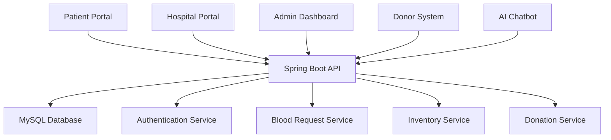

# 🏥 Blood Bank Management System

> A comprehensive platform connecting patients, hospitals, donors, and administrators to streamline blood donation and distribution processes.

[](https://angular.dev/)
[](https://spring.io/projects/spring-boot)
[](https://www.mysql.com/)
[](LICENSE)

## 🩸 What This Application Does

The Blood Bank Management System is a full-stack web application that:

- **🔗 Connects Patients** with blood banks for urgent medical needs
- **🏥 Manages Hospital Operations** for blood request processing and inventory
- **🩸 Coordinates Donor Activities** with smart scheduling and tracking
- **📊 Provides Admin Analytics** for system oversight and decision-making
- **🤖 Offers AI Assistance** through an intelligent chatbot for 24/7 support

## ✨ Key Features

### 👤 Patient Portal
- 📝 Submit and track blood requests
- 🏥 Choose from registered hospitals
- ⚡ Emergency request prioritization
- 📈 Real-time status monitoring

### 🏥 Hospital Management
- ✅ Process and approve blood requests
- 📊 Monitor blood inventory levels
- 🚨 Critical stock alerts
- 📋 Manage hospital profiles

### 🩸 Donor System
- 📋 Complete donor registration
- 🎯 Eligibility verification
- 📅 Appointment scheduling
- 🏆 Impact tracking

### 📊 Admin Dashboard
- 📈 System analytics and insights
- 👥 User management
- 🏥 Hospital oversight
- 📢 Campaign management

### 🤖 AI Chatbot
- 💬 24/7 intelligent assistance
- 🩸 Blood type education
- 📋 Donation guidance
- 🆘 Emergency information

## 🚀 Quick Start

### Prerequisites
- Node.js 18+ & npm
- Java 17+ & Maven
- MySQL 8.0+

### Installation

```bash
# Clone the repository
git clone <repository-url>
cd blood-bank-system

# Backend (Spring Boot)
cd Bks
mvn spring-boot:run

# Frontend (Angular) - New Terminal
cd blood-bank-frontend
npm install
npm start
```

### Access Points
- **Frontend**: http://localhost:4200
- **Backend API**: http://localhost:8080/api
- **API Docs**: http://localhost:8080/swagger-ui.html

## 🎮 How It Works

### For Patients
1. **Register/Login** to your account
2. **Submit Blood Request** with medical details
3. **Select Hospital** from available options
4. **Track Status** in real-time dashboard

### For Hospital Staff
1. **Login** to hospital portal
2. **Review Requests** from patients
3. **Approve/Reject** based on availability
4. **Manage Inventory** and get critical alerts

### For Donors
1. **Create Profile** with medical information
2. **Check Eligibility** automatically
3. **Schedule Donation** at preferred location
4. **Track Impact** of your donations

## 🏗️ Tech Stack

### Frontend
- **Angular 17+** with standalone components
- **Tailwind CSS** for modern UI
- **RxJS** for reactive programming
- **TypeScript** for type safety

### Backend
- **Spring Boot 3.x** with Java 17
- **Spring Security** with JWT
- **JPA/Hibernate** for database
- **MySQL** for data storage

### Key Features
- 🔐 Role-based authentication
- 📱 Responsive design
- ⚡ Real-time updates
- 🤖 AI-powered chatbot
- 📊 Advanced analytics

## 📱 Application Screenshots

*(Add screenshots here when available)*

## 🛡️ Security

- **JWT Authentication** for secure access
- **Role-Based Authorization** (Patient, Hospital, Admin, Donor)
- **Input Validation** and sanitization
- **Password Encryption** with Bcrypt
- **CORS Configuration** for API security

## 📊 System Architecture



## 🎯 User Roles & Permissions

| Role | Permissions | Access Level |
|------|-------------|--------------|
| **Patient** | Submit requests, track status | Personal data only |
| **Hospital** | Process requests, manage inventory | Hospital data |
| **Admin** | System oversight, user management | Full system |
| **Donor** | Manage profile, schedule donations | Personal data |

## 📈 Impact & Statistics

- 🩸 **Blood Requests**: Efficient processing and tracking
- 🏥 **Hospital Partners**: Streamlined inventory management
- 👥 **Donor Engagement**: Increased participation through technology
- ⚡ **Emergency Response**: Faster critical blood availability
- 📊 **Data Analytics**: Better decision making with insights

## 🤝 Contributing

We welcome contributions! Please see our [Contributing Guidelines](CONTRIBUTING.md) for details.

### Development Setup
```bash
# Frontend development
cd blood-bank-frontend
ng serve

# Backend development  
cd Bks
mvn spring-boot:run

# Run tests
npm test          # Frontend
mvn test          # Backend
```

## 🐛 Troubleshooting

### Common Issues
- **Database Connection**: Verify MySQL credentials
- **Port Conflicts**: Ensure 8080 and 4200 are available
- **Dependencies**: Run `npm install` and `mvn clean install`

### Getting Help
- 📖 Check [Documentation](docs/)
- 🐛 Report [Issues](issues)
- 💬 Join [Discussions](discussions)

## 📄 License

This project is licensed under the MIT License - see the [LICENSE](LICENSE) file for details.

## 👥 Team

- **Project Lead**: [Your Name]
- **Backend**: [Backend Developer]
- **Frontend**: [Frontend Developer] 
- **UI/UX**: [Designer]

## 📞 Contact

- 📧 Email: support@bloodbank.com
- 📱 Documentation: [Link]
- 🐛 Issues: [GitHub Issues]

---

**⭐ Star this repository if it helps you!**

**🩸 Together, we're saving lives through technology and innovation.**
