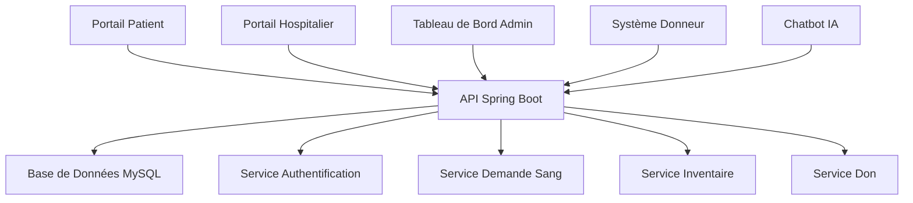

# 🏥 Système de Gestion Banque de Sang

> Plateforme complète connectant patients, hôpitaux, donneurs et administrateurs pour optimiser les processus de don et distribution de sang.

[](https://angular.dev/)
[](https://spring.io/projects/spring-boot)
[](https://www.mysql.com/)
[](LICENSE)

## 🩸 Ce Que Fait Cette Application

Le Système de Gestion Banque de Sang est une application web complète qui :

- **🔗 Connecte les Patients** avec les banques de sang pour leurs besoins médicaux urgents
- **🏥 Gère les Opérations Hospitalières** pour le traitement des demandes de sang et la gestion des stocks
- **🩸 Coordonne les Activités des Donneurs** avec planification intelligente et suivi
- **📊 Fournit des Analytics Admin** pour la supervision du système et la prise de décision
- **🤖 Offre une Assistance IA** via un chatbot intelligent disponible 24/7

## ✨ Fonctionnalités Clés

### 👤 Portail Patient
- 📝 Soumettre et suivre les demandes de sang
- 🏥 Choisir parmi les hôpitaux enregistrés
- ⚡ Priorisation des demandes d'urgence
- 📈 Suivi du statut en temps réel

### 🏥 Gestion Hospitalière
- ✅ Traiter et approuver les demandes de sang
- 📊 Surveiller les niveaux d'inventaire de sang
- 🚨 Alertes critiques de stock
- 📋 Gérer les profils hospitaliers

### 🩸 Système Donneur
- 📋 Inscription complète des donneurs
- 🎯 Vérification d'éligibilité
- 📅 Planification des rendez-vous
- 🏆 Suivi de l'impact

### 📊 Tableau de Bord Admin
- 📈 Analytics et insights du système
- 👥 Gestion des utilisateurs
- 🏥 Supervision hospitalière
- 📢 Gestion des campagnes

### 🤖 Chatbot IA
- 💬 Assistance intelligente 24/7
- 🩸 Éducation sur les groupes sanguins
- 📋 Guide de don
- 🆘 Informations d'urgence

## 🚀 Démarrage Rapide

### Prérequis
- Node.js 18+ & npm
- Java 17+ & Maven
- MySQL 8.0+

### Installation

```bash
# Cloner le dépôt
git clone <url-dépôt>
cd blood-bank-system

# Backend (Spring Boot)
cd Bks
mvn spring-boot:run

# Frontend (Angular) - Nouveau Terminal
cd blood-bank-frontend
npm install
npm start
```

### Points d'Accès
- **Frontend**: http://localhost:4200
- **Backend API**: http://localhost:8080/api
- **API Docs**: http://localhost:8080/swagger-ui.html

## 🎮 Comment Ça Marche

### Pour les Patients
1. **S'inscrire/Se connecter** à votre compte
2. **Soumettre une Demande de Sang** avec détails médicaux
3. **Sélectionner un Hôpital** parmi les options disponibles
4. **Suivre le Statut** dans le tableau de bord en temps réel

### Pour le Personnel Hospitalier
1. **Se connecter** au portail hospitalier
2. **Examiner les Demandes** des patients
3. **Approuver/Rejeter** selon disponibilité
4. **Gérer l'Inventaire** et recevoir les alertes critiques

### Pour les Donneurs
1. **Créer un Profil** avec informations médicales
2. **Vérifier l'Éligibilité** automatiquement
3. **Planifier un Don** à l'emplacement préféré
4. **Suivre l'Impact** de vos dons

## 🏗️ Stack Technique

### Frontend
- **Angular 17+** avec composants standalone
- **Tailwind CSS** pour UI moderne
- **RxJS** pour programmation réactive
- **TypeScript** pour sécurité des types

### Backend
- **Spring Boot 3.x** avec Java 17
- **Spring Security** avec JWT
- **JPA/Hibernate** pour base de données
- **MySQL** pour stockage des données

### Fonctionnalités Clés
- 🔐 Authentification par rôle
- 📱 Design responsive
- ⚡ Mises à jour en temps réel
- 🤖 Chatbot IA
- 📊 Analytics avancés

## 📱 Captures d'Écran de l'Application

*(Ajouter des captures d'écran quand disponibles)*

## 🛡️ Sécurité

- **Authentification JWT** pour accès sécurisé
- **Autorisation par Rôle** (Patient, Hôpital, Admin, Donneur)
- **Validation d'Entrée** et assainissement
- **Chiffrement Mot de Passe** avec Bcrypt
- **Configuration CORS** pour sécurité API

## 📊 Architecture Système



## 🎯 Rôles Utilisateur & Permissions

| Rôle | Permissions | Niveau d'Accès |
|------|-------------|--------------|
| **Patient** | Soumettre demandes, suivre statut | Données personnelles uniquement |
| **Hôpital** | Traiter demandes, gérer inventaire | Données hospitalières |
| **Admin** | Supervision système, gestion utilisateurs | Système complet |
| **Donneur** | Gérer profil, planifier dons | Données personnelles |

## 📈 Impact & Statistiques

- 🩸 **Demandes de Sang**: Traitement et suivi efficaces
- 🏥 **Partenaires Hospitaliers**: Gestion optimisée des stocks
- 👥 **Engagement Donneurs**: Participation accrue via technologie
- ⚡ **Réponse d'Urgence**: Disponibilité sanguine critique plus rapide
- 📊 **Analytics de Données**: Meilleure prise de décision avec insights

## 🤝 Contribuer

Nous accueillons les contributions! Veuillez voir nos [Directives de Contribution](CONTRIBUTING.md) pour détails.

### Configuration Développement
```bash
# Développement frontend
cd blood-bank-frontend
ng serve

# Développement backend  
cd Bks
mvn spring-boot:run

# Exécuter les tests
npm test          # Frontend
mvn test          # Backend
```

## 🐛 Dépannage

### Problèmes Communs
- **Connexion Base de Données**: Vérifier les identifiants MySQL
- **Conflits de Ports**: S'assurer que 8080 et 4200 sont disponibles
- **Dépendances**: Exécuter `npm install` et `mvn clean install`

### Obtenir de l'Aide
- 📖 Consulter [Documentation](docs/)
- 🐛 Signaler [Problèmes](issues)
- 💬 Rejoindre [Discussions](discussions)

## 📄 Licence

Ce projet est sous licence MIT - voir le fichier [LICENSE](LICENSE) pour détails.

## 👥 Équipe

- **Chef de Projet**: [Nom du Chef]
- **Backend**: [Développeur Backend]
- **Frontend**: [Développeur Frontend] 
- **UI/UX**: [Designer]

---

**⭐ Mettre une étoile à ce dépôt s'il vous aide!**

**🩸 Ensemble, nous sauvons des vies grâce à la technologie et l'innovation.**
